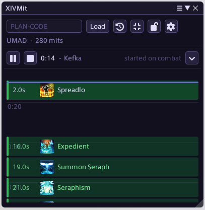
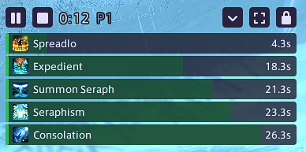

# XIVMit (Dalamud plugin)

In-game view of a [xivmit.app](https://xivmit.app) mitigation plan. Shows your upcoming
mitigations against a live fight clock, starts on combat, and stays synced automatically as the
fight progresses.

## Status

Working first version, live-tested now, not just clean-build-verified. Plan loading, the sync
engine, and the overlay have all run against real pulls; a few real bugs (mismatched countdown
state, a spurious auto-start outside real content) turned up and got fixed that way. The zone-
memory features and the lock-window button are newer and still untested live.

## Features

- **Loads a plan straight from xivmit.app.** Enter a plan code (the part after `?plan=` in the
  URL) and your roster, mitigations, and fight timing show up in-game - no export step.
- **Starts and stops itself.** The clock starts when combat begins and stops on a wipe or clear,
  so there's nothing to remember to press.
- **Stays in sync automatically.** As the fight actually plays out, the plugin watches for phase
  transitions and boss casts/hits and corrects the clock to match, so a pull running faster or
  slower than expected doesn't throw off your mitigation timing. This is tuned specifically for
  FRU, UMAD, DSR, and TOP; other fights fall back to a more general heuristic.
- **Remembers plans per duty.** Load a plan once in a given duty and the plugin remembers it,
  offering to reload it (or opening on its own) the next time you zone back in. Auto-start can
  also be limited to duties where the loaded plan has actually been used before, so combat
  starting in unrelated content doesn't spuriously start the clock.
- **Two views**: a full scrolling timeline, or a compact overlay that sits directly on the game.
- **Friendly error messages.** A bad plan code, an unreachable server, or a timeout shows up as a
  plain sentence, not a raw error.

## The two views

**Full** is a scrolling time axis: mitigations enter at the bottom and rise toward a NOW line, so
a mitigation's position on screen is its distance in time. The wheel scrolls the viewport ahead of
the clock without moving the clock itself; ctrl+wheel zooms the axis.

**Overlay** drops the title bar, plan bar, and settings, replacing the timeline with a compact
stack of draining bars - each bar's own length counts down to when its mitigation is due, rather
than position on an axis. It's meant to sit directly on top of the game during a pull: the window
background and border are fully transparent, and just the controls you'd actually reach for
mid-fight stay - play/pause/stop, phase buttons, and a way back to the full view.

Both views carry a lock button to pin the window in place, and a collapsible phase strip for
jumping to (or manually correcting to) a specific phase.

## Usage

- `/xivmit` opens the window
- `/xivmit <plan-code>` loads a plan code directly
- `/xivmit overlay` toggles overlay mode

The plan code is the part after `?plan=` in a xivmit.app URL.

## Installing

`/xlsettings` -> Experimental -> Custom Plugin Repositories -> add
`https://raw.githubusercontent.com/RoarkGit/DalamudPlugins/main/pluginmaster.json`, then enable
XIVMit in the plugin installer.
